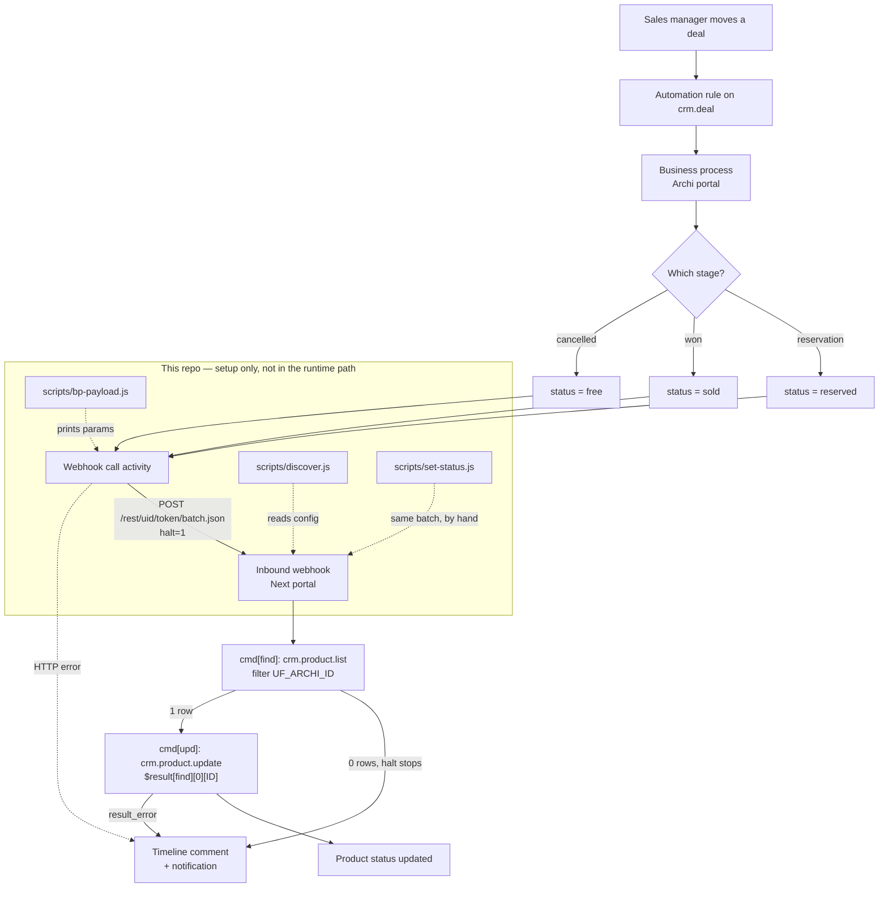

<!-- last-synced: 2026-09-18, commit: 2ad9894 -->
# Architecture

Two independent Bitrix24 **box** portals, joined by one HTTP call. There is no server, no queue and no
shared database. The only runtime component is the business process inside the Archi portal.

## Components

| Component | Lives in | Responsibility |
|---|---|---|
| Deal automation rule | Archi portal | Fires the business process when a deal enters a configured stage |
| Business process | Archi portal | Picks the target status per stage, calls the Next webhook, handles the response |
| Inbound webhook | Next portal | Authenticates the call; exposes `crm.*` / `catalog.*` REST under one portal user |
| `lib/bitrix.js` | this repo (CLI only) | REST client: param encoding, `batch`, retry, error typing |
| `lib/statusUpdate.js` | this repo (CLI only) | Builds the find+update batch; single source of truth for the payload shape |
| `lib/env.js` | this repo (CLI only) | Reads `.env`, redacts tokens in output |
| `scripts/discover.js` | this repo (CLI only) | Reads field config from both portals, generates `docs/*-fields.md` |
| `scripts/set-status.js` | this repo (CLI only) | Executes the same batch by hand for verification |
| `scripts/bp-payload.js` | this repo (CLI only) | Prints the exact parameters the BP activity needs |
| `config/mapping.json` | this repo | Field codes and status enum ids |

Nothing in this repo runs in production. It exists to discover the configuration, prove the REST contract,
and dictate the BP parameters. Once the BP is configured, the integration runs without it.

## Data flow

| Hop | Protocol | Auth | Payload | Failure handling |
|---|---|---|---|---|
| Deal → BP | internal | portal session | deal document | BP does not start if the rule does not match |
| BP → Next | HTTPS POST | static webhook token | `halt=1`, `cmd[find]`, `cmd[upd]` | `halt=1` aborts before a blind update |
| Next internal | REST | webhook user rights | `$result[find]` chaining | `result_error` returned per command |
| BP → user | internal | — | timeline comment, notification | this is the only audit trail |

## Extension points

- **Status set** — `STATUS_KEYS` in `lib/statusUpdate.js`. Adding a fourth status means a new enum id in
  `config/mapping.json`, a new BP branch, and a PRD change.
- **Product API** — the `API` table in `lib/statusUpdate.js` holds every difference between `crm.*` and
  `catalog.*` (method names, `$result` chain path, field case). Switching is a one-line config change
  (`next.api`), not a rewrite.
- **Join key** — `next.archiIdField` in `config/mapping.json`. `UF_ARCHI_ID` today, `XML_ID` or
  `property<id>` if the box version cannot filter on it.
- **Direction** — a reverse (Next → Archi) flow reuses `lib/bitrix.js` unchanged and needs a second
  mapping section plus an inbound webhook on Archi. Blocked on PRD Open question 2.
- **Middleware** — if retry and central logging become necessary, the same `batch` payload moves into a
  service without any change on the Next side. See D-1.

## Not present, deliberately

No custom Bitrix module, no PHP activity, no OAuth application, no event subscriptions, no scheduler,
no persistent state, no runtime dependency.
