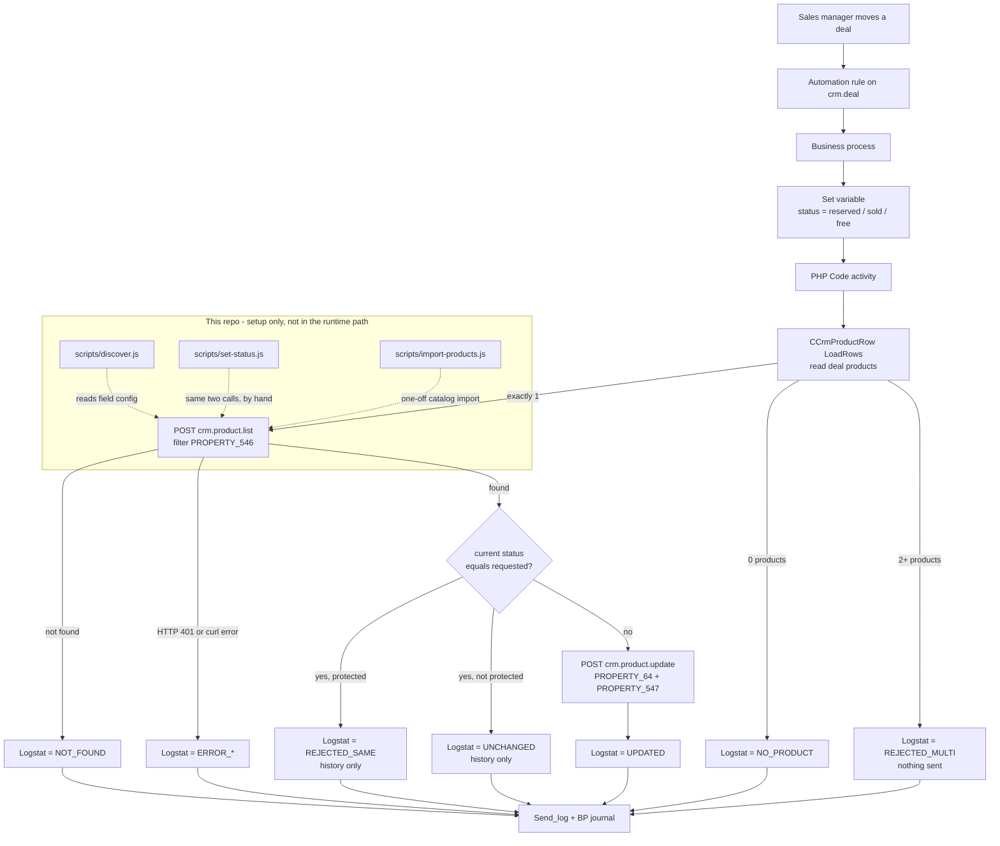

<!-- last-synced: 2026-09-20, commit: 2113838 -->
# Architecture

Two independent Bitrix24 **box** portals, joined by two HTTP calls per run. There is no server, no queue
and no shared database. The only runtime component is the business process inside the Archi portal.

## Components

| Component | Lives in | Responsibility |
|---|---|---|
| Deal automation rule | Archi portal | Fires the business process when a deal enters a configured stage |
| Business process | Archi portal | Sets the `status` variable per branch, then runs the PHP Code activity |
| **PHP Code activity** | Archi portal | The whole integration: reads the deal product rows, calls Next twice over `curl`, writes `Logstat` + `Send_log`. Reference copy: `docs/bp/block.php` |
| Inbound webhook | Next portal | Authenticates the call; exposes `crm.*` REST under one portal user (scope `crm`) |
| `lib/bitrix.js` | this repo (CLI only) | REST client: param encoding, `batch`, retry, error typing |
| `lib/statusUpdate.js` | this repo (CLI only) | Builds the find+update batch; single source of truth for the payload shape |
| `lib/env.js` | this repo (CLI only) | Reads `.env`, redacts tokens in output |
| `scripts/discover.js` | this repo (CLI only) | Reads field config from both portals, generates `docs/*-fields.md` |
| `scripts/set-status.js` | this repo (CLI only) | Executes the same batch by hand for verification |
| `scripts/bp-payload.js` | this repo (CLI only) | Prints `batch` parameters for a webhook-activity setup — superseded by the PHP block |
| `scripts/parse-export.js` | this repo (CLI only) | Parses the Bitrix HTML export (`.xls`) into a field report or JSON |
| `scripts/import-products.js` | this repo (CLI only) | Imports apartments into a Next catalog section; idempotent on `PROPERTY_546` |
| `config/mapping.json` | this repo | Field codes, catalog/section ids, status texts |

Nothing in this repo runs in production. It exists to discover the configuration, prove the REST contract,
import the catalog, and supply the PHP the BP runs. Once the BP is configured, the integration runs without it.

**The production code lives in the Archi BP template.** `docs/bp/block.php` is the reference copy and has
to be carried across by hand when it changes — there is no deployment step (D-11).

## Data flow

| Hop | Protocol | Auth | Payload | Failure handling |
|---|---|---|---|---|
| Deal → BP | internal | portal session | deal document | BP does not start if the rule does not match |
| BP → Archi CRM | native PHP | portal context | `CCrmProductRow::LoadRows` | read-only; 0 or 2+ rows abort the run |
| BP → Next (1) | HTTPS POST | static webhook token | `crm.product.list`, filter on `PROPERTY_546` | 0 rows → abort before any write |
| BP → Next (2) | HTTPS POST | static webhook token | `crm.product.update`, status + history | status omitted when unchanged |
| BP → owner | internal | — | `Logstat`, `Send_log`, BP journal | the audit trail on the Archi side |
| Next product | stored | — | one `PROPERTY_547` line per run | the audit trail on the Next side |

## Extension points

- **Status set** — `$MAP` in `docs/bp/block.php` and `STATUS_KEYS` in `lib/statusUpdate.js`. Adding a
  fourth status means a new entry in both, plus a PRD change. `$PROTECTED` decides which ones cannot be
  overwritten by an identical request.
- **Product API** — the `API` table in `lib/statusUpdate.js` holds every difference between `crm.*` and
  `catalog.*` (method names, `$result` chain path, field case). Switching is a one-line config change
  (`next.api`), not a rewrite.
- **Join key** — `next.archiIdField` in `config/mapping.json`, `$F_ID` in `block.php`. `PROPERTY_546`
  today; `XML_ID` holds the same value as a spare.
- **Import target** — `next.sectionId` / `next.catalogId`. `import-products.js` reads the section name
  from the portal, so another project needs no code change.
- **Direction** — a reverse (Next → Archi) flow reuses `lib/bitrix.js` unchanged and needs a second
  mapping section plus an inbound webhook on Archi. Blocked on PRD Open question 2.
- **Middleware** — if retry and central logging become necessary, the same two calls move into a service
  without any change on the Next side. See D-1.

## Not present, deliberately

No custom Bitrix module, no OAuth application, no event subscriptions, no scheduler, no persistent state,
no runtime dependency, no `batch` in the production path.
